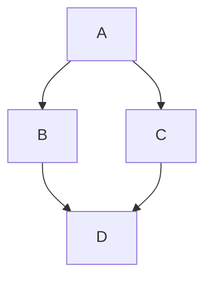

# Architecture

Multiple components and mechanisms are used to create and run the environment. Let's list them and see how they work together.

## Module building

Modules are created using [EasyBuild](https://easybuild.io/). They are based on configurations that you will find in the [highlander-easyconfigs](https://github.com/odh-highlander/highlander-easyconfigs) repository.

In the [module-builder](https://github.com/odh-highlander/module-builder) repository, you will find the recipe for a container image that will be ready to use to build your modules. Of course a pre-built image is available.

## Module management

This tool allows you to easily manage modules in your shared libraries: you can launch local builds, or directly fetch pre-built modules from repositories. You can also choose which module you want to show to your users, and which ones you want to promote.

Two repositories are available for this tool: [module-manager-backend](https://github.com/odh-highlander/module-manager-backend) and [module-manager-frontend](https://github.com/odh-highlander/module-manager-frontend).

## JupyterLab extension

The [jupyterlab-extension](https://github.com/odh-highlander/jupyterlab-extension) extension provides a new menu in JupyterLab to easily browse available modules, load/unload them, or create your collections for easy environment setup.

## JupyterLab

In the [jupyterlab-highlander](https://github.com/odh-highlander/jupyterlab-highlander) repository, you will find the recipe to create a JupyterLab container image that will include the necessary components and configuration to dynamically load modules from the shared library. Of course a pre-built image is available.

